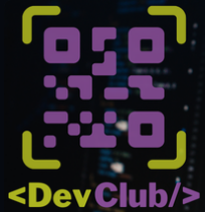

# Application for user registration

 <h2>Academic project full stack finished</h2>
  
 > Result of the finished project. This project had as main objective, the creation of a user interface, where, in a certain platform, their registrations are carried out and sent to the server for storage and future consultations.
  
  

### Adjustments and improvements

The project was fully completed and the following resources were used:

- [x] 
- [x] 
- [x] 
- [x]  (for design consultation)
- [x]  (for test)
- [x] 
- [x] 
- [x] 
- [x] 
- [x] 
- [x] 

## 🤝 Collaborators

<table>
  <tr>
    <td align="center">
      <a href="https://www.linkedin.com/in/edmar-radanovis-0130b611a/">
         
        
          <b>Edmar Radanovis</b>
        
      </a>
    </td>
    <td align="center">
       <a href="https://rodolfomori.com.br/devclub/">
         
        
          <b>DevClub</b>
        
      </a>
  </tr>
</table>

[⬆ Voltar ao topo](#application-for-user-registration) 

